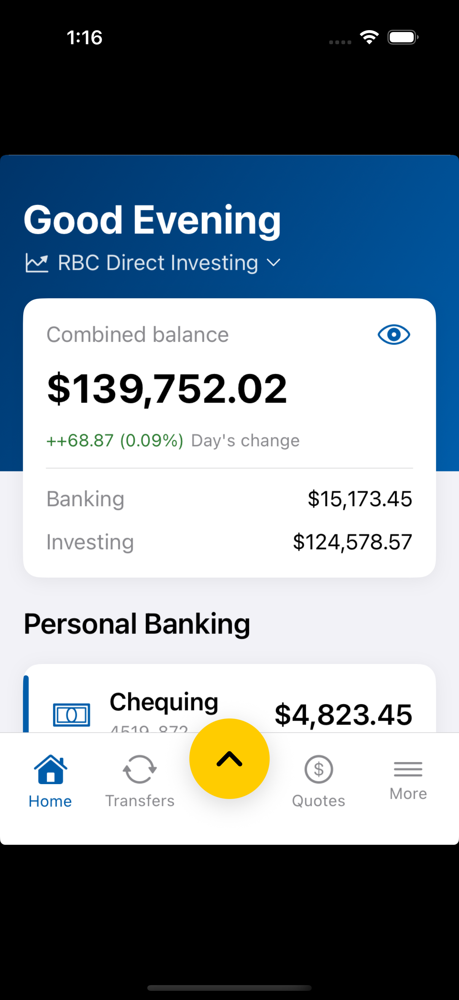
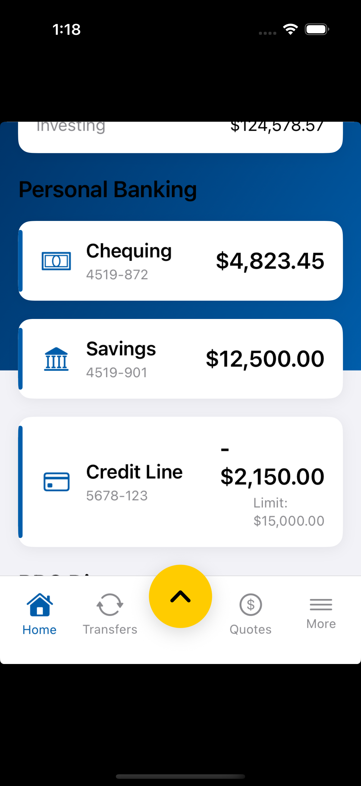
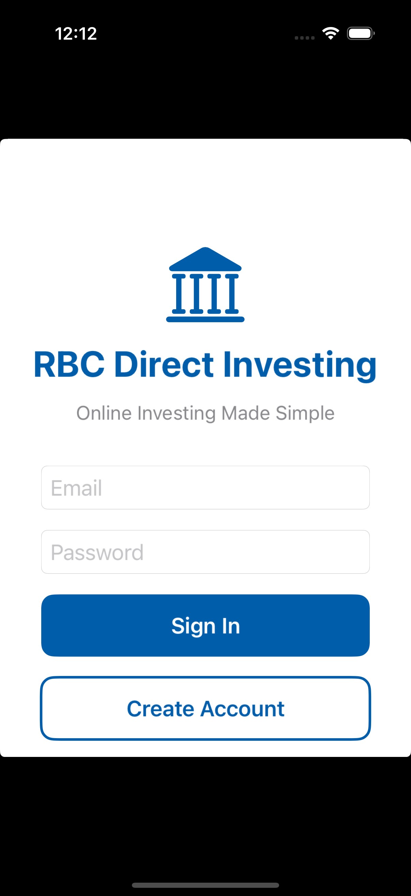

# RBC Direct Investing - App Improvement Prototype

A working iOS prototype built on top of an [RBC Direct Investing](https://www.rbcdirectinvesting.com/) clone, implementing three feature improvements I identified through product analysis. Each feature addresses a real gap in the current app that competitors like Wealthsimple and Bloom have already solved.

The full PRD is available at [`PRD.pdf`](PRD.pdf).

> **Try it live:** [Launch on Appetize.io](https://appetize.io/app/YOUR_APP_ID) &mdash; tap **"Try Demo Account"** to explore with mock data.

---

## The Problem

| Gap | Current Experience | Competitive Pressure |
|---|---|---|
| **Fragmented view** | Banking and investing live in separate tabs with no combined total | Every fintech shows a single net-worth number |
| **No mobile allocation** | Desktop has a Portfolio Analyzer; mobile shows a flat list | Bloom's pie-chart view is a key differentiator |
| **No auto-invest** | Every trade is manual | Wealthsimple's auto-invest is consistently cited as a reason to leave bank brokerages |

---

## What I Built

### 1. Unified Account Dashboard

Merged Personal Banking (Chequing, Savings, Credit Line) and Direct Investing (TFSA, RRSP, FHSA) into a single Home screen with a combined net-worth card. No new data access needed &mdash; the app already has both banking and investing data; this is purely a UI improvement.

<p align="center">
  
  &nbsp;&nbsp;
  
</p>

- Combined balance card with Banking / Investing breakdown and day's change
- Personal Banking section: Chequing, Savings, Credit Line (with limit display)
- Direct Investing section: TFSA, RRSP, FHSA with gain/loss badges
- Gold accent bar for investing accounts, blue for banking

### 2. Portfolio Allocation Breakdown

Interactive donut chart showing percentage allocation across all holdings, brought from the desktop Portfolio Analyzer to mobile. Tap any slice for a detail sheet with book cost, market value, gain/loss, and a sparkline.

<p align="center">
  
</p>

- Toggle between **By Holding** and **By Sector** grouping
- Color-coded legend with percentage labels
- Slices under 5% have labels hidden to reduce clutter
- Built with [DGCharts](https://github.com/danielgindi/Charts) (donut style, 45% hole radius)

### 3. Auto-Invest

Recurring buy orders for any stock or ETF, across all account types. Users set a symbol, dollar amount, frequency (weekly/monthly), and funding account. This is the feature most requested by Canadian retail investors switching to Wealthsimple.

<!-- Add screenshots here: transfers tab, auto-invest empty state, auto-invest setup form -->

- Set up recurring investments with from/to account pickers
- Weekly or monthly frequency with market-hours disclaimer
- Pause, modify, or delete rules anytime with swipe actions
- Rules persisted locally via UserDefaults (Codable encoding)

---

## UI Overhaul

Beyond the three features, the entire app UI was rebuilt to match the real RBC Direct Investing app:

- **Custom tab bar** with Home, Transfers, center FAB button, Quotes, and More (replaced the generic 5-tab layout)
- **Yellow FAB button** with spring animation for quick actions (Place Order, View Status, Activity, Watchlists)
- **Blue gradient header** with time-based greeting
- **Quotes tab** with search, commission-free ETF promo, recent searches with sparklines, and market overview
- **More tab** with grouped menu items and sign-out

<p align="center">
  
</p>

---

## Tech Stack

| Layer | Technology |
|---|---|
| **iOS Client** | SwiftUI (iOS 17+), Swift 5.9, MVVM |
| **Charts** | DGCharts 5.1.0 via SPM (UIViewRepresentable) |
| **Backend** | Spring Boot 3.2.3, Java 21 |
| **Database** | PostgreSQL (prod) / H2 in-memory (demo) |
| **Project Gen** | XcodeGen (`project.yml` &rarr; `.xcodeproj`) |

## Running Locally

```bash
# 1. Generate the Xcode project
brew install xcodegen
xcodegen generate

# 2. Open in Xcode and run on a simulator
open RBCInvesting.xcodeproj

# 3. (Optional) Start the backend for live data
cd rbc-api
./mvnw spring-boot:run -Dspring-boot.run.profiles=demo
```

Tap **"Try Demo Account"** on the login screen. The app works fully offline with mock data &mdash; no backend required.

---

## Project Structure

```
RBCInvesting/
  App/                  # App entry point, assets
  Models/               # All data models (Auth, Account, Holding, Order, etc.)
  Views/
    Auth/               # Login, Register
    Dashboard/          # HomeView, BankingAccountCard, PortfolioAllocationSection, SliceDetailView
    Holdings/           # HoldingsView with sort & filter
    Transfers/          # TransfersView, AutoInvestView, AutoInvestSetupSheet
    Quotes/             # QuotesView with search & sparklines
    More/               # MoreView (settings, order status)
    Charts/             # PieChartRepresentable (DGCharts wrapper)
    Components/         # MainTabView, FABButton, QuickActionsSheet
  ViewModels/           # PortfolioVM, AuthVM, BankingVM, AutoInvestVM, etc.
  Services/             # APIService
  Extensions/           # Theme (colors, modifiers, reusable components)
rbc-api/                # Spring Boot backend
PRD.pdf                 # Product Requirements Document
```

---

*Built by Kelly Kim*
