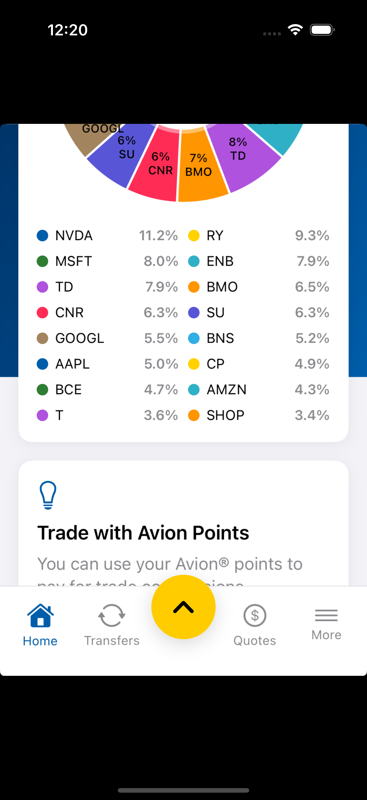

# RBC Direct Investing — App Improvement Prototype

I use RBC Direct Investing daily and kept running into the same friction points: no combined view of my banking + investing accounts, no portfolio allocation chart on mobile (even though desktop has one), and no way to set up recurring investments. Wealthsimple and Bloom have solved all three. So I built a working iOS prototype that adds them.

**[Read the full PRD](PRD.pdf)** for the problem analysis, evidence, and success criteria behind each feature.

<p align="center">
  
  &nbsp;
  
  &nbsp;
  
</p>

---

## What I Changed (and Why)

### Unified Account Dashboard

Right now, banking and investing live in completely separate profiles. You have to switch back and forth and do mental math to figure out your total balance. Every fintech competitor shows a single net-worth number — RBC doesn't.

I merged Personal Banking (Chequing, Savings, Credit Line) and Direct Investing (TFSA, RRSP, FHSA) into one Home screen with a combined net-worth card at the top. The app already has access to both sets of data, so this is purely a UI change — no new API calls needed.

<p align="center">
  
  &nbsp;&nbsp;
  
</p>

### Portfolio Allocation Breakdown

The desktop Trading Dashboard has a full Portfolio Analyzer with asset-class, sector, and regional breakdowns. On mobile? You get a flat list of holdings. That's it. Bloom's pie-chart view is one of their main selling points, and it's not hard to see why.

I brought a version of this to mobile — an interactive donut chart showing percentage allocation across all holdings. Tap any slice for a detail sheet with book cost, market value, gain/loss, and a sparkline. You can toggle between grouping by holding or by sector.

<p align="center">
  
  &nbsp;&nbsp;
  
</p>

Built with [DGCharts](https://github.com/danielgindi/Charts) — donut style, 45% hole radius, labels hidden for slices under 5% to keep it clean.

### Auto-Invest

Every trade on RBC is manual. If you want to dollar-cost average into an ETF, you have to remember to log in and place the order yourself. Wealthsimple's auto-invest is one of the most-cited reasons people leave bank brokerages on r/PersonalFinanceCanada.

I added recurring buy orders for any stock or ETF, across all account types. Users pick a symbol, dollar amount, frequency (weekly or monthly), and funding account. Rules can be paused, modified, or deleted with swipe actions. Everything is persisted locally via UserDefaults with Codable encoding.

---

## UI Overhaul

Beyond the three features, I rebuilt the app's navigation and visual design to match what the real RBC Direct Investing app actually looks like:

- Custom tab bar — Home, Transfers, center FAB button, Quotes, More
- Yellow floating action button with spring animation for quick actions (Place Order, View Status, Activity, Watchlists)
- Blue gradient header with time-based greeting
- Quotes tab with search, commission-free ETF promo, recent searches with sparklines
- More tab with grouped menu items and sign-out

<p align="center">
  
</p>

A full walkthrough is in the [demo video](screenshots/demo.mp4).

---

## Tech Stack

| | |
|---|---|
| **iOS** | SwiftUI (iOS 17+), Swift 5.9, MVVM |
| **Charts** | DGCharts 5.1.0 via SPM (UIViewRepresentable wrapper) |
| **Backend** | Spring Boot 3.2.3, Java 21 |
| **Database** | PostgreSQL (prod) / H2 in-memory (demo) |
| **Project Gen** | XcodeGen (`project.yml` &rarr; `.xcodeproj`) |

## Running Locally

```bash
# Generate the Xcode project
brew install xcodegen
xcodegen generate

# Open in Xcode and run on a simulator
open RBCInvesting.xcodeproj

# (Optional) Start the backend for live data
cd rbc-api
./mvnw spring-boot:run -Dspring-boot.run.profiles=demo
```

Tap **"Try Demo Account"** on the login screen — the app works fully offline with mock data, no backend required.

---

## Project Structure

```
RBCInvesting/
  App/                  # Entry point, assets
  Models/               # Data models (Auth, Account, Holding, Order, etc.)
  Views/
    Auth/               # Login, Register
    Dashboard/          # HomeView, BankingAccountCard, PortfolioAllocationSection
    Holdings/           # HoldingsView with sort & filter
    Transfers/          # TransfersView, AutoInvestView, AutoInvestSetupSheet
    Quotes/             # QuotesView with search & sparklines
    More/               # MoreView (settings, order status)
    Charts/             # PieChartRepresentable (DGCharts wrapper)
    Components/         # MainTabView, FABButton, QuickActionsSheet
  ViewModels/           # PortfolioVM, AuthVM, BankingVM, AutoInvestVM, etc.
  Services/             # APIService
  Extensions/           # Theme colors, modifiers, reusable components
rbc-api/                # Spring Boot backend
PRD.pdf                 # Product Requirements Document
```

---

*Built by Kelly Kim*
